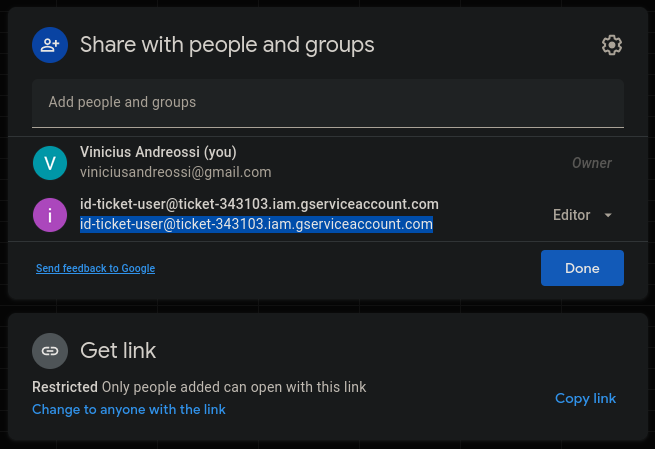

# 1Ticket
Criei esse programa para auxiliar as repúblicas da minha faculdade que não conseguiam encontrar uma forma boa de vender ingressos para as festas na pandemia. Como vender ingressos presencialmente era uma ideia politicamente incorreta, muitas pessoas criaram diversas formas de vendê-los virtualmente, e essa é a minha.

O 1Ticket junta uma planilha do Google Sheets e um sistema de geração de QRCodes. Assim, um ingresso vendido gera um QRCode com um ID e o email do comprador. Automaticamente, o programa envia o QRCode para o email do cliente e atualiza a planilha do Google Sheets. O pagamento e o controle de presenças são sugeridos, mas fogem do escopo do programa.

Por enquanto, para utilizar o programa é necessário que o usuário tenha a API e as bibliotecas de Python utilizadas em sua máquina. Posteriormente pretendo
desenvolver um executável para o programa. Sugestões são bem vindas!!

## Como utilizar

### 1o passo: Criar uma planilha

Primeiramente será necessário criar uma planilha do Google Sheets seguindo o modelo a seguir:

Em seguida, será necessário compartilhar a planilha com a Service Account do 1Ticket. Para saber mais sobre Service Accounts, clique [aqui](https://cloud.google.com/iam/docs/service-accounts). Para isso, basta compartilhar a tabela com o email da service account (id-ticket-user@ticket-343103.iam.gserviceaccount.com).

Para terminar essa etapa, falta apenas obter o ID da planilha. Ele é obtido através do URL, logo após o /d/. Ou seja, se o seu URL for *https://docs.google.com/spreadsheets/d/xyz123/edit#gid=0*, o ID da sua planilha é *xyz123*.

### 2o passo: Preencher o arquivo config.txt

Preencha o arquivo config.txt da seguinte maneira:

* EMAIL DO VENDEDOR: seu@email.com
* SENHA DO VENDEDOR: suaSenha123
* ID GOOGLE SHEET: Coloque o ID obtido na seção anterior
ASSUNTO DO EMAIL: Assunto do email com o QRCode
TEXTO DO EMAIL: 
{
Escreva uma mensagem legal para os seus clientes!
ID: {} // Deixe essa última linha para que o cliente receba o ID dele no email!
}

### 3o passo: Execute o programa!

Por enquanto, é necessário que a planilha tenha pelo menos 1 usuário cadastrado, ou então haverá um erro (esse bug será fixado). A função de consultar ainda não está pronta, mas já é possível vender ingressos para seus clientes! Garanto que eles receberão um email direitinho :)